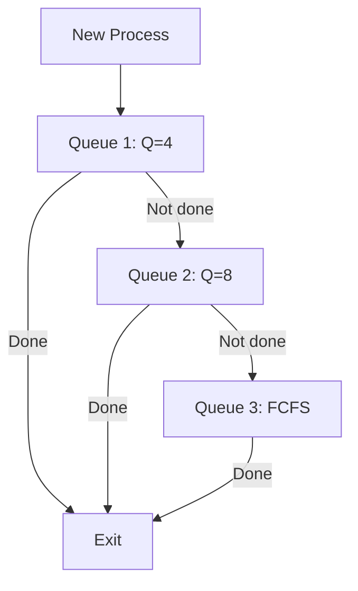

# CPU Scheduling Simulator

A console app that simulates how an OS schedules processes.It covers three algorithms - FCFS, Round Robin and Priority Scheduling. You pick one from the menu, enter burst times and it shows you the waiting time, turnaround time and a timeline chart.

## How to build and run

You need g++ installed. Then just:

```bash
g++ -Wall -o scheduler main.cpp fcfs.cpp roundrobin.cpp priority.cpp sjf.cpp srtf.cpp hrrn.cpp ljf.cpp lrtf.cpp mlfq.cpp
./scheduler
```

Or if you have make:

```bash
make
./scheduler
```

OUTPUT :

```
=========================================
      CPU Scheduling Simulator
=========================================

--- Menu ---
1. FCFS (First Come First Serve)
2. Round Robin
3. Priority Scheduling
4. Exit

Enter choice:
```
---

## The Algorithms

| Algorithm | Pros | Cons |
|---|---|---|
| FCFS | Simple, easy to implement | Long processes block short ones |
| Round Robin | Fair, everyone gets a turn | Depends on quantum size a lot |
| Priority | Important stuff runs first | Low priority processes can starve |
| SJF | Minimum average waiting time | Hard to know burst time in real life |
| SRTF | Even better than SJF | Lots of switching (overhead) |
| HRRN | No starvation, fair | Complex calculation |
| LJF | Simple | Long jobs block short ones (worst case) |
| LRTF | Fairer for long jobs | High overhead |
| MLFQ | Good balance for all jobs | Complex to tune |

### 1. FCFS (First Come First Serve)

This is the simplest one. Processes run in the order they arrive. Whoever comes first gets the CPU first.

Working :
- First process starts immediately so its waiting time is 0
- For every next process, its waiting time = previous waiting time + previous burst time
- Turnaround time = waiting time + burst time

```
say we have 3 processes with burst times 5, 3, 8

P1 arrives first, runs for 5 units
P2 waits for P1 to finish (wt=5), then runs for 3
P3 waits for P1+P2 (wt=8), then runs for 8
```

The timeline looks like:

```
 ---------- ------ ----------------
|    P1    |  P2  |       P3       |
 ---------- ------ ----------------
0          5      8               16
```

```
P   WT   TAT
1    0    5
2    5    8
3    8   16
```


---

### 2. Round Robin

Each process gets a fixed time slice called quantum. If its not done in that time it goes back to the end of the queue and the next process gets a turn. This keeps going until everyone is done.

How it works:
- Copy burst times into a remaining array
- Go through each process, let it run for quantum or whatever is left
- If remaining time > quantum, subtract quantum and move on
- If remaining time <= quantum, process is done, calculate waiting time
- Keep looping until all remaining times are 0

```
processes with burst 5, 3, 8 and quantum = 2

Round 1: P1 runs 2, P2 runs 2, P3 runs 2
Round 2: P1 runs 2, P2 runs 1 (done), P3 runs 2
Round 3: P1 runs 1 (done), P3 runs 2
Round 4: P3 runs 2 (done)
```

Timeline:

```
 ---- ---- ---- ---- -- ---- -- ---- ----
| P1 | P2 | P3 | P1 |P2| P3 |P1| P3 | P3 |
 ---- ---- ---- ---- -- ---- -- ---- ----
0    2    4    6    8  9   11 12   14   16
```


---

### 3. SJF (Shortest Job First)

This algorithm picks the process with the shortest burst time first. It's non-preemptive, meaning once a process starts, it finishes.

- Since they all arrive at time 0 right now, it's very easy: just pick the smallest one first

```
processes with burst 5, 3, 8

- P2 has smallest burst (3), runs first
- P1 has next smallest (5), runs second
- P3 is longest (8), runs last
```

Timeline:

```
 ------ ---------- ----------------
|  P2  |    P1    |       P3       |
 ------ ---------- ----------------
0      3          8               16
```


---

### 4. SRTF (Shortest Remaining Time First)

This is the preemptive version of SJF. At every time tick, the OS checks if there is any other process with a shorter remaining time than the current one.

- At each step, pick the one with the smallest remaining time
- Run for 1 unit and check again
- (Note: Because everyone arrives at t=0, it will look like SJF for now, but the code is ready for preemption if arrival times are added!)

```
processes with burst 5, 3, 8

- At t=0, P2 is shortest (3), runs to completion (since no one else arrives)
- At t=3, P1 is now shortest (5), runs to completion
- Finally P3 (8) runs
```

Timeline:

```
 ------ ---------- ----------------
|  P2  |    P1    |       P3       |
 ------ ---------- ----------------
0      3          8               16
```


---

### 5. HRRN (Highest Response Ratio Next)

- Response Ratio = (Waiting Time + Burst Time) / Burst Time
- If a process waits a long time, its ratio goes up, so it eventually gets to run.

```
processes with burst 5, 3, 8

- At t=0, P1 runs first (FCFS order for t=0)
- At t=5, P1 finishes.
  RR(P2) = (5+3)/3 = 2.66
  RR(P3) = (5+8)/8 = 1.62
- P2 has higher RR, runs next till t=8
- P3 runs last till t=16
```

Timeline:

```
 ---------- ------ ----------------
|    P1    |  P2  |       P3       |
 ---------- ------ ----------------
0          5      8               16
```


---

Exactly what it says on the tin. Opposite of SJF. Picks the process with the longest burst time first. Useful for some specific batch systems maybe?

```
processes with burst 5, 3, 8

- P3 is longest (8), runs first
- P1 is next longest (5), runs second
- P2 is shortest (3), runs last
```

Timeline:

```
 ---------------- ---------- ------
|       P3       |    P1    |  P2  |
 ---------------- ---------- ------
0                8         13     16
```

---

Preemptive version of LJF. At every step, pick the one with the longest remaining time. 

```
processes with burst 5, 3, 8

- At t=0, P3 is longest. Runs for 3 units (until its remaining time is 5)
- At t=3, P3 and P1 both have 5 units left.
- Logic picks next in line (P1), runs for some time, keeps balancing them.
```

Timeline:

```
 ------ ------ ------ ------ ------ ------ ------
|  P3  |  P1  |  P3  |  P1  |  P3  | ...etc...  |
 ------ ------ ------ ------ ------ ------ ------
0      3      4      5      6      7           16
```
(Simplified view - actual timeline depends on precise tick-by-tick swaps)

---

### 8. MLFQ (Multi Level Feedback Queue)

- Q3: Low priority, FCFS

Processes that use up their whole quantum in a high queue get demoted to a lower one.

```
processes with burst 5, 3, 8 | Q1=4, Q2=8

Q1: P1 runs 4 (moves to Q2), P2 runs 3 (done), P3 runs 4 (moves to Q2)
Q2: P1 runs 1 (done), P3 runs 4 (done)
```

Timeline:

```
 -------- ------ -------- -- --------
|   P1   |  P2  |   P3   |P1|   P3   |
 -------- ------ -------- -- --------
0        4      7       11 12       16
```



---

### 9. Priority Scheduling

Each process has a priority number. Lower number = higher priority. We sort the processes by priority and then its basically FCFS on the sorted list.

How it works:
- Copy everything into temp arrays
- Bubble sort by priority (swap process id and burst time along with it) using bubble sort by priority (ascending = lower number means higher priority) easy that's why its not fast tho 
- After sorting, calculate wt and tat same as FCFS


Note : I used bubble sort for simplicity, but the time complexity is O(n²). The performance can be improved by replacing it with a more efficient sorting method like quick sort or merge sort.

```
processes with burst 5, 3, 8 and priorities 2, 1, 3

after sorting by priority:
P2 (pri=1) -> P1 (pri=2) -> P3 (pri=3)

P2 runs first for 3 units
P1 runs next for 5 units
P3 runs last for 8 units
```

Timeline:

```
 ------ ---------- ----------------
|  P2  |    P1    |       P3       |
 ------ ---------- ----------------
0      3          8               16
```


---

## File structure

```
CPU Scheduler/
  main.cpp         - menu, input, main loop
  header files/fcfs.h - fcfs function declaration
  fcfs.cpp         - fcfs algorithm
  header files/roundrobin.h - round robin declaration
  roundrobin.cpp   - round robin algorithm
  header files/priority.h - priority scheduling declaration
  priority.cpp     - priority scheduling algorithm
  header files/sjf.h - sjf declaration
  sjf.cpp          - sjf algorithm
  header files/srtf.h - srtf declaration
  srtf.cpp         - srtf algorithm
  header files/hrrn.h - hrrn declaration
  hrrn.cpp         - hrrn algorithm
  header files/ljf.h - ljf declaration
  ljf.cpp          - ljf algorithm
  header files/lrtf.h - lrtf declaration
  lrtf.cpp         - lrtf algorithm
  header files/mlfq.h - mlfq declaration
  mlfq.cpp         - mlfq algorithm
  Makefile         - build file
```

---

## Why no vectors, structs, sort, etc

Im still learning C++ and right now im comfortable with arrays and basic loops. I know vectors and STL sort exist and they would make some things shorter but I want to understand how things work at a lower level first before using shortcuts. Same with structs - I could group process data together but for now separate arrays do the job fine.

Will probably refactor later when I get better at C++.

---

## Contributing

If you wanna improve this or add more algorithms, feel free to fork it and open a PR. Some things that could be added:

- Arrival times (right now all processes arrive at time 0)
- Better input validation
- Reading from a file instead of typing everything

Just keep the code simple and readable. No need to over-engineer it.

---

## License

Do whatever you want with it.
